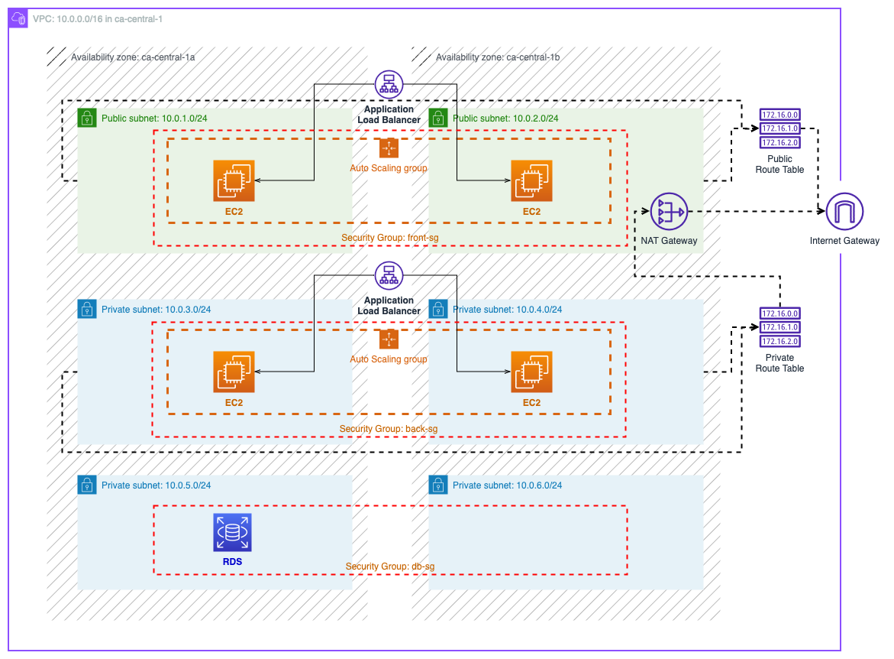

# Three-tier Architecture in AWS and Terraform

A three-tier architecture with:
* 3 tiers: frontend (public-facing), backend (private), database (private)
* 3 Security Groups, one for each tier
* 1 vpc in a region.
* 2 public subnets in 2 availability zones.
* 6 private subnets in 2 availability zones.
* 1 Internet Gateway.
* 1 Network Address Translation (NAT) Gateway.
* 2 Route Tables
* 1 Internet-facing Application Load Balancer
* 1 Auto-Scaling Group in the frontend tier
* 1 Internal Application Load Balancer
* 1 Auto-Scaling Group in the backend tier
* 1 RDS subnet group
* 1 RDS (MySQL) in the database tier
## Prerequisites
1. Need to have .an AWS account
2. Need to have your [AWS credentials](https://docs.aws.amazon.com/cli/latest/userguide/cli-configure-files.html#cli-configure-files-methods) all set.
3. Need to have a key pair for provisioning EC2. Use the private key to ssh to EC2.
4. [Install Terraform](https://developer.hashicorp.com/terraform/tutorials/aws-get-started/install-cli)
## Usage:
#### Provision Resources
```bash=
$ terraform init
$ terraform plan
$ terraform apply
```
### Tear Down resources
```bash=
$ terraform destroy
```

## Variables
Most variables have default values in `variable.tf`. Modify them as you need. You need to specify the name of the key pair when using `terraform plan/apply/destroy`

* `region`: the region you want to put your VPC in
* `az1`: the first AZ. 
* `az2`: the second AZ.
* `db-name`: The name of the database name
* `db-username`: The username
* `db-password`: The password
* `keypair`: The name of the keypair for provisioning EC2
* `tags`: Tags to add to resources

## Outputs
* `db_address`: The hostname of the RDS instance. Need this to connect to RDS from the backend tier.
* `db_port`: the database port
* `public_alb_address`: The DNS name of the public-facing load balancer. Put it in the browser to access servers running on EC2s in the frontend tier.
* `private_alb_address`: The DNS name of the internal-facing load balancer. It won't work if you put it in the browser (it's INTERNAL-facing, close to public). ssh into EC2 instances and `curl '<private_alb_address>` then it works.

## Connecting to RDS from backend tier
1. `ssh` into EC2 instances in the backend tier
2. `mysql --host=<db_address> --user=<db-username> -p <db-name>`. Use `-p` so you'll be prompted to enter the password `<db-password>`.